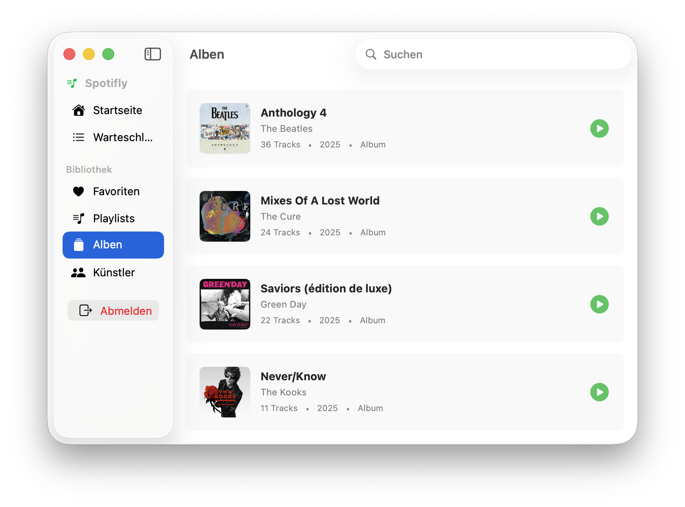
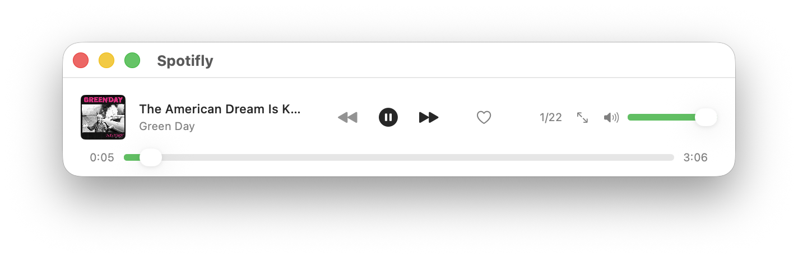
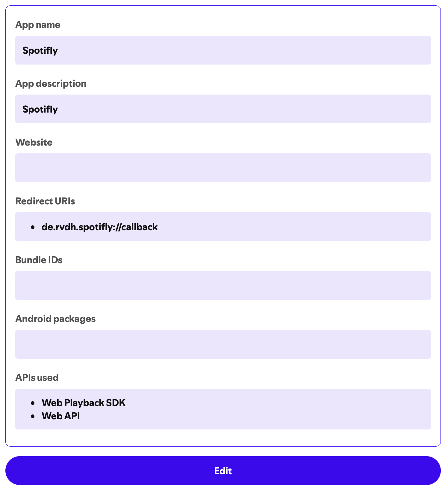

# Spotifly

A lightweight Spotify player for macOS.

**[Website](https://ralph.github.io/Spotifly/)** · **[Download](https://github.com/ralph/Spotifly/releases/latest)**

> [!IMPORTANT]
> **Spotify Client ID Required**
> This app requires your own Spotify Client ID to function. Spotify has [re-enabled developer access](https://developer.spotify.com/blog/2026-02-06-update-on-developer-access-and-platform-security) — you can create a Client ID for free in the [Spotify Developer Dashboard](https://developer.spotify.com/dashboard). See [Setting Up Your Client ID](#setting-up-your-client-id) below for instructions and the [February 2026 API changes](https://developer.spotify.com/documentation/web-api/references/changes/february-2026) for details on the current Web API.

## Screenshots

### Album View


### Miniplayer


## Installation

### Direct Download

1. Download the [latest release](https://github.com/ralph/spotifly/releases/latest)
2. Extract the ZIP file
3. Move `Spotifly.app` to your Applications folder
4. Open Spotifly from Applications

### Homebrew

```bash
brew install ralph/spotifly/spotifly
```

## Requirements

- macOS 26.2 or later
- Spotify Premium account

## Features

- Lightweight and fast
- Native macOS app built with SwiftUI
- Spotify Web API integration
- Recently played tracks, albums, artists, and playlists
- Queue management with drag-and-drop reordering
- Playback controls
- Search functionality
- Favorites management

## Setting Up Your Client ID

Spotifly requires a Spotify Client ID. While it's recommended to create a new Spotify app just for Spotifly, you can also use an existing Spotify app—just add `de.rvdh.spotifly://callback` to its Redirect URIs (you can have multiple redirect URIs in one app).

### Option A: Create a New Spotify App (Recommended)

1. Go to the [Spotify Developer Dashboard](https://developer.spotify.com/dashboard/)
2. Click **Create app**
3. Fill in the required fields:
   - **App name**: Anything you like (e.g., "Spotifly")
   - **App description**: Anything you like
   - **Redirect URIs**: Add exactly `de.rvdh.spotifly://callback`
   - **APIs used**: Select **Web API** and **Web Playback SDK**
4. Accept the terms and click **Save**
5. Open your newly created app and go to **Settings**
6. Copy the **Client ID** (not the Client Secret)

All other fields (Website, Bundle IDs, Android packages) can be left empty.



### Option B: Use an Existing Spotify App

If you already have a Spotify app configured:

1. Go to your app in the [Spotify Developer Dashboard](https://developer.spotify.com/dashboard/)
2. Go to **Settings**
3. Add `de.rvdh.spotifly://callback` to the **Redirect URIs** (you can have multiple)
4. Save the settings
5. Copy the **Client ID**

### Configure Spotifly

1. Open Spotifly
2. Enter your Client ID on the login screen
3. Click **Connect with Spotify**

Your Client ID will be saved securely in the macOS Keychain and used for all future sessions.

## Keyboard Shortcuts

### Playback

| Shortcut | Action |
|----------|--------|
| Space | Play / Pause |
| ⌘ → | Next track |
| ⌘ ← | Previous track |
| ⌘ L | Like / Unlike current track |

### Navigation

| Shortcut | Action |
|----------|--------|
| ⌘ 1 | Go to Favorites |
| ⌘ 2 | Go to Playlists |
| ⌘ 3 | Go to Albums |
| ⌘ 4 | Go to Artists |
| ⌘ F | Focus search field |
| ⌘ R | Refresh (on startpage) |

## Development

See [DEVELOPMENT.md](DEVELOPMENT.md) for build instructions and architecture documentation.

## License

This project is licensed under the MIT License - see the [LICENSE](LICENSE) file for details.
